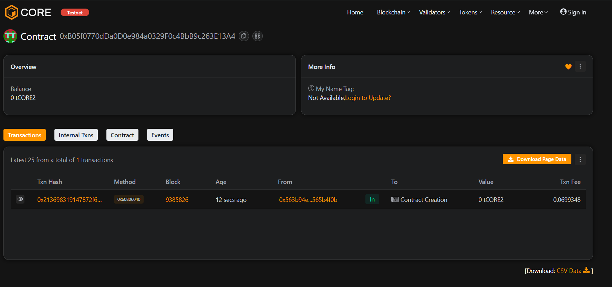

# ⚡ ChainPulseX

### Project Description
**ChainPulseX** is a decentralized activity tracking system that allows users to record on-chain actions in a transparent and immutable way.  
Each recorded action is timestamped and permanently stored on the Ethereum blockchain, ensuring integrity and traceability.

---

### 🌍 Project Vision
To revolutionize how digital activity logs are maintained by moving from centralized storage to transparent, blockchain-based records — empowering users with control, proof, and permanence of their actions.

---

### ✨ Key Features
- **Action Recording:** Users can record specific actions on-chain.  
- **Immutable History:** Each action is permanently logged on Ethereum.  
- **Admin Management:** Admin can transfer control securely.  
- **Transparency:** All activities can be publicly verified.

---

### 🚀 Future Scope
- Integration with decentralized identity (DID).  
- Add encrypted metadata for privacy.  
- Build a React-based dashboard to visualize activity logs.  
- Introduce role-based permissions (admin, auditor, user).  
- Extend to multi-chain compatibility.

---

### 🧰 Tech Stack
- **Solidity** – Smart contract logic  
- **Hardhat** – Ethereum development environment  
- **JavaScript** – Testing and deployment  
- **Ethereum / Sepolia Testnet**

---

Contract detail:0xB05f0770dDa0D0e984a0329F0c4BbB9c263E13A4


### 🪄 Commands

```bash
# Install dependencies
npm install

# Compile contracts
npx hardhat compile

# Run tests
npx hardhat test

# Deploy to Sepolia testnet
npx hardhat run scripts/deploy.js --network sepolia

